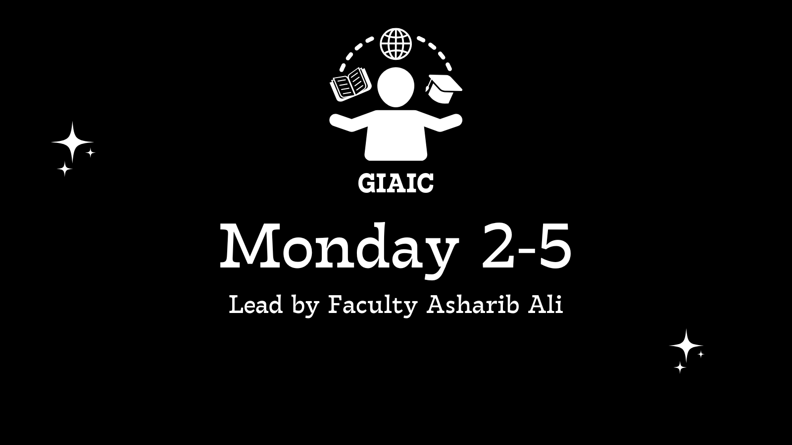

# GIAIC Quarter-3 (Monday 2-5) Session

This repository is maintained for **1500+ students** who access it daily.

## 📌 What You’ll Find Here  
This repository contains:  
- 📂 **All class codes**  
- 💻 **Projects**  
- 📝 **Assignments**  

## 📚 Led by Faculty: **Asharib Ali**  
Stay updated with the latest resources, practice materials, and assignments provided throughout the sessions.  

Happy coding 🚀
